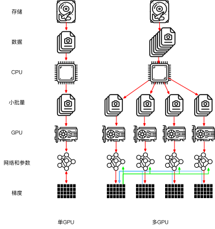
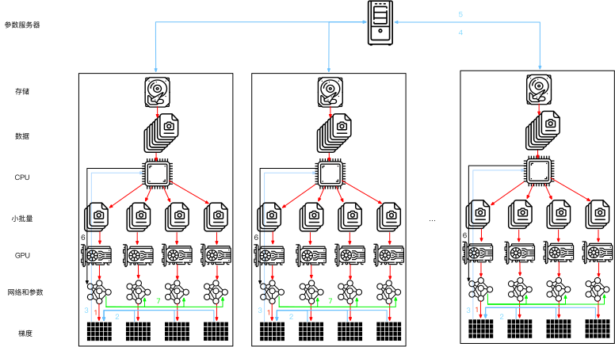

# 参数服务器
:label:`sec_parameterserver`

当我们从单个 GPU 迁移到多个 GPU，然后迁移到包含多个 GPU 的多台服务器（可能全部分布在多个机架和网络交换机上）时，我们的分布式和并行训练算法需要变得更加复杂。细节很重要，因为不同的互连具有非常不同的带宽（例如，nvLink 可以在适当的设置下在 6 条链路上提供高达 100 Gb/s 的宽度，PCIe 4.0（16 通道）提供 32 Gb/s，甚至高速 100GbE 以太网也只能达到 10 Gb/s）。同时，期望统计建模人员成为网络和系统方面的专家是不合理的。 

参数服务器的核心理念是在 :cite:`Smola.Narayanamurthy.2010` 中在分布式潜在变量模型的背景下引入的。随后在 :cite:`Ahmed.Aly.Gonzalez.ea.2012` 中对推拉语义进行了描述，随后在 :cite:`Li.Andersen.Park.ea.2014` 中对系统和开源库进行了描述。在下面我们将激励提高效率所需的组件。 

## 数据并行培训

让我们回顾一下分布式培训的数据并行培训方法。我们将使用它来排除本节中的所有其他内容，因为它在实践中的实施要简单得多。几乎没有任何其他并行策略首选的用例（除了图表上的深度学习之外），因为 GPU 现在有足够的内存。:numref:`fig_parameterserver` 描述了我们在 :numref:`sec_multi_gpu` 中实施的数据并行度的变体。其中的关键方面是，渐变聚合发生在 GPU 0 上，然后再将更新的参数重新广播到所有 GPU。 

:label:`fig_parameterserver`

回想起来，对 GPU 0 进行聚合的决定似乎相当临时。毕竟，我们也许也可以在 CPU 上聚合起来。事实上，我们甚至可以决定在一个 GPU 上聚合一些参数，另一个 GPU 上的一些参数聚合起来。如果优化算法支持这一点，那么我们没有真正的理由不能。例如，如果我们有四个带有相关渐变 $\mathbf{g}_1, \ldots, \mathbf{g}_4$ 的参数向量，我们可以在一个 GPU 上聚合每个 $\mathbf{g}_i$ ($i = 1, \ldots, 4$) 的渐变。 

这种推理似乎是武断和轻率的。毕竟，数学始终是一样的。但是，我们正在处理真实的物理硬件，其中不同的总线具有不同的带宽，如 :numref:`sec_hardware` 中所述。考虑一个真正的 4 路 GPU 服务器，如 :numref:`fig_bw_hierarchy` 中所述。如果它的连接特别好，它可能有 100 GbE 网卡。更典型的数字在 1—10 GbE 范围内，有效带宽为 100 MB/s 至 1 Gb/s。由于 CPU 的 PCIe 通道太少，无法直接连接到所有 GPU（例如，消费级英特尔 CPU 有 24 条通道），我们需要 [multiplexer](https://www.broadcom.com/products/pcie-switches-bridges/pcie-switches)。16x Gen3 链路上 CPU 的带宽为 16 Gb/s。这也是每个 GPU 连接到交换机的速度。这意味着设备之间的通信更有效。 

:label:`fig_bw_hierarchy`

为了这个论点，让我们假设渐变是 160 MB。在这种情况下，将所有剩余 3 个 GPU 的渐变发送到第四个 GPU 需要 30 毫秒（每次传输需要 10 毫秒 = 160 MB /16 Gb/s）。再增加 30 毫秒以将重量向量传送回来，我们总共达到 60 毫秒。如果我们将所有数据发送到 CPU，我们将受到 40 毫秒的罚款，因为四个 GPU 中的 * 每个 * 都需要将数据发送到 CPU，总共产生 80 毫秒。最后假设我们能够将渐变分成 4 个部分，每个 40 MB。现在我们可以将每个部分同时聚合在不同的 GPU * 上，因为 PCIe 交换机在所有链路之间提供了全带宽操作。而不是 30 毫秒，这需要 7.5 毫秒，同步操作总共产生 15 毫秒的时间。简而言之，根据我们同步参数的方式，同一操作可能需要 15 毫秒到 80 毫秒的任何时间。:numref:`fig_ps_distributed` 描述了交换参数的不同策略。 

:label:`fig_ps_distributed`

请注意，在提高绩效方面，我们还有另一种工具可供我们使用。: in a deep network it takes some time to compute all gradients from the top to the bottom. We can begin synchronizing gradients for some parameter groups even while we are still busy computing them for others. See e.g., :cite:`Sergeev.Del-Balso.2018` 有关如何在 [Horovod](https://github.com/horovod/horovod) 中做到这一点的详细信息。 

## 振铃同步

当涉及到现代深度学习硬件的同步时，我们经常会遇到大量定制的网络连接。例如，AWS p3.16xlarge 和 NVIDIA DGX-2 实例共享 :numref:`fig_nvlink` 的连接结构。每个 GPU 都通过 PCIe 链路连接到主机 CPU，该链路最多运行时间为 16 Gb/s。此外，每个 GPU 还有 6 个 nvLink 连接，每个连接都能双向传输 300 Gbit/s。这相当于每个方向每条链路约 18 Gb/s。简而言之，总的 nvLink 带宽明显高于 PCIe 带宽。问题是如何最有效地使用它。 

:label:`fig_nvlink`

事实证明，最佳同步策略是将网络分解为两个环，然后使用它们直接同步数据 :cite:`Wang.Li.Liberty.ea.2018`。:numref:`fig_nvlink_twoloop` 说明，可以将网络分解为带双 NVLink 带宽的一个环（1-2-3-4-5-6-7-8-1），常规带宽。在这种情况下，设计高效的同步协议非常重要。 

:label:`fig_nvlink_twoloop`

考虑下面的思维实验：给定 $n$ 个计算节点（或 GPU）的环，我们可以将梯度从第一个节点发送到第二个节点。在那里，它被添加到局部渐变中并发送到第三个节点，依此类推。$n-1$ 步之后，可以在上次访问的节点中找到聚合渐变。也就是说，聚合渐变的时间随节点数量线性增长。但是，如果我们这样做，算法就非常低效。毕竟，在任何时候都只有一个节点通信。如果我们将梯度分解为 $n$ 块并开始从节点 $i$ 开始同步块 $i$，该怎么办？由于每个区块的大小为 $1/n$，所以现在的总时间是 $(n-1)/n \approx 1$。换句话说，随着我们增加戒指尺寸，聚合渐变所花费的时间 * 不会增加 *。这是一个非常惊人的结果。:numref:`fig_ringsync` 说明了 $n=4$ 节点上的步骤顺序。 

:label:`fig_ringsync`

如果我们使用同样的示例在 8 个 V100 GPU 之间同步 160 MB，我们的目标是大约 $2 \cdot 160 \mathrm{MB} / (3 \cdot 18 \mathrm{GB/s}) \approx 6 \mathrm{ms}$。尽管我们现在正在使用 8 个 GPU，但这比使用 PCIe 总线更好。请注意，实际上这些数字有点差，因为深度学习框架通常无法将通信组合为大规模突发传输。  

请注意，有一种常见的误解是，环形同步与其他同步算法有根本不同。唯一的区别是，与简单的树相比，同步路径更加精细。 

## 多机培训

在多台机器上进行分布式培训增加了进一步的挑战：我们需要与仅通过相对较低带宽的结构连接的服务器进行通信，在某些情况下，这种结构可能会慢一个数量级以上。跨设备同步非常棘手。毕竟，运行训练代码的不同机器将具有微妙的不同速度。因此，如果我们想使用同步分布式优化，我们需要 * 同步 * 它们。:numref:`fig_ps_multimachine` 说明了分布式并行训练的发生方式。 

1. 在每台计算机上读取一批（不同）数据，分割到多个 GPU 之间，然后传输到 GPU 内存中。每个 GPU 批次上都会分别计算预测和梯度。
2. 来自所有本地 GPU 的渐变聚合在一个 GPU 上（或者其中的一部分聚合在不同的 GPU 上）。
3. 渐变将发送到 CPU。
4. CPU 将渐变发送到聚合所有渐变的中央参数服务器。
5. 然后使用聚合渐变来更新参数，更新后的参数将广播回各个 CPU。
6. 信息被发送到一个（或多个）GPU。
7. 更新后的参数分布在所有 GPU 中。

:label:`fig_ps_multimachine`

这些操作中的每一项似乎都相当简单。而且，事实上，它们可以在单台机器内 * 高效地执行。但是，一旦我们看到多台机器，我们可以看到中央参数服务器成为瓶颈。毕竟，每台服务器的带宽是有限的，因此对于 $m$ 个工作人员，将所有梯度发送到服务器所需的时间是 $\mathcal{O}(m)$。我们可以通过将服务器数量增加到 $n$ 来突破这一障碍。此时，每台服务器只需存储 $\mathcal{O}(1/n)$ 参数，因此更新和优化的总时间将变为 $\mathcal{O}(m/n)$。无论我们正在处理多少工作人员，匹配这两个数字都可以持续扩展。实际上，我们使用 * 相同 * 机器作为工作人员和服务器。:numref:`fig_ps_multips` 说明了设计（有关详细信息，另请参阅 :cite:`Li.Andersen.Park.ea.2014`）。特别是，确保多台机器在没有不合理的延迟的情况下工作是非常重要的。我们省略了关于障碍的详细信息，只会在下面简要介绍同步和异步更新。 

:label:`fig_ps_multips`

## 钥匙-价值存储

在实践中执行分布式多 GPU 培训所需的步骤并非微不足道。这就是为什么使用通用抽象是值得的，即具有重新定义更新语义的 * 键值存储 * 的抽象。  

在许多工作人员和许多 GPU 中，梯度 $i$ 的计算可以定义为 

$$\mathbf{g}_{i} = \sum_{k \in \text{workers}} \sum_{j \in \text{GPUs}} \mathbf{g}_{ijk},$$

其中 $\mathbf{g}_{ijk}$ 是在工人 $k$ 的 GPU $j$ 上分割的梯度 $i$ 的一部分。此操作的关键方面是它是 * 交换减少 *，也就是说，它将许多向量变成一个矢量，应用操作的顺序无关紧要。这对我们来说非常棒，因为我们不（需要）对何时接收哪个梯度进行精细的控制。此外，请注意，此操作在不同的 $i$ 之间是独立的。 

这使我们可以定义以下两种操作：* push *（累积渐变）和 *pull*（检索聚合渐变）。由于我们有许多不同的渐变集（毕竟，我们有很多图层），因此我们需要用键 $i$ 对渐变进行索引。与密钥价值存储的这种相似之处，例如 Dynamo :cite:`DeCandia.Hastorun.Jampani.ea.2007` 中引入的那种类似之处并非巧合。它们也满足许多类似的特征，特别是在将参数分配到多台服务器时。 

键值存储的推拉操作描述如下： 

* **push（键、值）** 将工作线程中的特定渐变（值）发送到公共存储器。在那里，这个值是汇总的，例如，通过对其进行汇总。
* **pull（键、value）** 从公共存储中检索聚合值，例如，在合并来自所有工作人员的梯度之后。

通过隐藏简单的推拉操作背后的所有同步复杂性，我们可以解决希望能够简单地表达优化的统计建模师和需要处理分布式同步固有的复杂性的系统工程师的担忧。 

## 小结

* 同步需要高度适应服务器内的特定网络基础架构和连接。这可能会对同步所需的时间产生重大影响。
* 对于 p3 和 DGX-2 服务器来说，环形同步可能是最佳选择。对于其他人来说可能不太多。
* 当添加多个参数服务器以增加带宽时，分层同步策略效果很好。

## 练习

1. 你能进一步增加振铃同步吗？提示：你可以双向发送消息。
1. 是否可以允许异步通信（在计算仍在进行时）？它如何影响性能？
1. 如果我们在长时间运行的计算中丢失了服务器怎么办？我们如何设计一个 * 容错 * 机制来避免完全重新启动计算？

[Discussions](https://discuss.d2l.ai/t/366)
