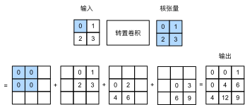
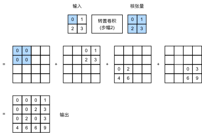

# 转置卷积
:label:`sec_transposed_conv`

到目前为止，我们看到的 CNN 图层，例如卷积图层 (:numref:`sec_conv_layer`) 和合并图层 (:numref:`sec_pooling`)，通常会减少（向下采样）输入的空间维度（高度和宽度），或者保持它们不变。在按像素级进行分类的语义分段中，如果输入和输出的空间维度相同，将很方便。例如，一个输出像素处的通道维度可以在同一空间位置保存输入像素的分类结果。 

为了实现这一点，特别是在空间维度被 CNN 图层减小后，我们可以使用另一种类型的 CNN 图层，这种类型可以增加（上采样）中间要素地图的空间维度。在本节中，我们将介绍 
*转置卷积 *，也称为 * 分数步长卷积 * :cite:`Dumoulin.Visin.2016`， 
用于在卷积之前扭转缩减采样操作。

```{.python .input}
from mxnet import np, npx, init
from mxnet.gluon import nn
from d2l import mxnet as d2l

npx.set_np()
```

```{.python .input}
#@tab pytorch
import torch
from torch import nn
from d2l import torch as d2l
```

## 基本操作

现在忽略渠道，让我们从基本的转置卷积操作开始，步幅为 1 且没有填充。假设我们获得了一个 $n_h \times n_w$ 输入张量和一个 $k_h \times k_w$ 内核。滑动内核窗口的步幅为 1，每行 $n_w$ 次，每列 $n_h$ 次，共产生 $n_h n_w$ 个中间结果。每个中间结果都是一个 $(n_h + k_h - 1) \times (n_w + k_w - 1)$ 张量，初始化为零。为了计算每个中间张量，输入张量中的每个元素都乘以内核，以便产生的 $k_h \times k_w$ 张量替换每个中间张量中的一部分。请注意，每个中间张量中被替换部分的位置对应于用于计算的输入张量中元素的位置。最后，对所有中间结果进行总结以产生产出结果。 

例如，:numref:`fig_trans_conv` 说明了如何为 $2\times 2$ 输入张量计算 $2\times 2$ 内核的转置卷积。 


:label:`fig_trans_conv`

我们可以（** 实现这个基本的转置卷积操作 **）`trans_conv` 用于输入矩阵 `X` 和内核矩阵 `K`。

```{.python .input}
#@tab all
def trans_conv(X, K):
    h, w = K.shape
    Y = d2l.zeros((X.shape[0] + h - 1, X.shape[1] + w - 1))
    for i in range(X.shape[0]):
        for j in range(X.shape[1]):
            Y[i: i + h, j: j + w] += X[i, j] * K
    return Y
```

与通过内核减少 * 输入元素的常规卷积（在 :numref:`sec_conv_layer` 中）相比，转置的卷积
*广播 * 输入元素 
通过内核，从而产生大于输入的输出。我们可以构造基本二维转置卷积运算的输入张量 `X` 和内核张量 `K` 从 :numref:`fig_trans_conv` 到 [** 验证上述实现的输出 **]。

```{.python .input}
#@tab all
X = d2l.tensor([[0.0, 1.0], [2.0, 3.0]])
K = d2l.tensor([[0.0, 1.0], [2.0, 3.0]])
trans_conv(X, K)
```

或者，当输入 `X` 和内核 `K` 都是四维张量时，我们可以 [** 使用高级 API 获得相同的结果 **]。

```{.python .input}
X, K = X.reshape(1, 1, 2, 2), K.reshape(1, 1, 2, 2)
tconv = nn.Conv2DTranspose(1, kernel_size=2)
tconv.initialize(init.Constant(K))
tconv(X)
```

```{.python .input}
#@tab pytorch
X, K = X.reshape(1, 1, 2, 2), K.reshape(1, 1, 2, 2)
tconv = nn.ConvTranspose2d(1, 1, kernel_size=2, bias=False)
tconv.weight.data = K
tconv(X)
```

## [** 填充、步幅和多个渠道 **]

与将填充应用于输入的常规卷积中不同，它应用于转置卷积中的输出。例如，当将高度和宽度两侧的填充数指定为 1 时，将从转置的卷积输出中删除第一行和最后一行和列。

```{.python .input}
tconv = nn.Conv2DTranspose(1, kernel_size=2, padding=1)
tconv.initialize(init.Constant(K))
tconv(X)
```

```{.python .input}
#@tab pytorch
tconv = nn.ConvTranspose2d(1, 1, kernel_size=2, padding=1, bias=False)
tconv.weight.data = K
tconv(X)
```

在转置卷积中，步幅指定为中间结果（因此输出），而不是输入。使用 :numref:`fig_trans_conv` 的相同输入和内核张量，将步幅从 1 更改为 2 会增加中间张量的高度和权重，因此输出张量在 :numref:`fig_trans_conv_stride2` 中。 


:label:`fig_trans_conv_stride2`

以下代码片段可以验证 :numref:`fig_trans_conv_stride2` 中的步幅为 2 的转置卷积输出。

```{.python .input}
tconv = nn.Conv2DTranspose(1, kernel_size=2, strides=2)
tconv.initialize(init.Constant(K))
tconv(X)
```

```{.python .input}
#@tab pytorch
tconv = nn.ConvTranspose2d(1, 1, kernel_size=2, stride=2, bias=False)
tconv.weight.data = K
tconv(X)
```

对于多个输入和输出通道，转置卷积的工作方式与常规卷积相同。假设输入有 $c_i$ 个通道，并且转置卷积为每个输入通道分配一个 $k_h\times k_w$ 内核张量。当指定多个输出通道时，我们将为每个输出通道有一个 $c_i\times k_h\times k_w$ 内核。 

同样，如果我们将 $\mathsf{X}$ 馈入卷积层 $f$ 以输出 $\mathsf{Y}=f(\mathsf{X})$ 并创建一个与 $f$ 相同的超参数的转置卷积层 $g$，但输出通道数量是 $\mathsf{X}$ 中的通道数，那么 $g(Y)$ 的形状将与 $\mathsf{X}$ 相同，那么 $g(Y)$ 的形状将与 $g(Y)$ 相同$\mathsf{X}$。可以在下面的示例中说明这一点。

```{.python .input}
X = np.random.uniform(size=(1, 10, 16, 16))
conv = nn.Conv2D(20, kernel_size=5, padding=2, strides=3)
tconv = nn.Conv2DTranspose(10, kernel_size=5, padding=2, strides=3)
conv.initialize()
tconv.initialize()
tconv(conv(X)).shape == X.shape
```

```{.python .input}
#@tab pytorch
X = torch.rand(size=(1, 10, 16, 16))
conv = nn.Conv2d(10, 20, kernel_size=5, padding=2, stride=3)
tconv = nn.ConvTranspose2d(20, 10, kernel_size=5, padding=2, stride=3)
tconv(conv(X)).shape == X.shape
```

## [** 连接到矩阵移位 **]
:label:`subsec-connection-to-mat-transposition`

转置卷积以矩阵移调命名。为了解释一下，让我们首先看看如何使用矩阵乘法实现卷积。在下面的示例中，我们定义了 $3\times 3$ 输入 `X` 和 $2\times 2$ 卷积内核 `K`，然后使用 `corr2d` 函数计算卷积输出 `Y`。

```{.python .input}
#@tab all
X = d2l.arange(9.0).reshape(3, 3)
K = d2l.tensor([[1.0, 2.0], [3.0, 4.0]])
Y = d2l.corr2d(X, K)
Y
```

接下来，我们将卷积内核 `K` 重写为包含大量零的稀疏权重矩阵 `W`。权重矩阵的形状是（$4$，$9$），其中非零元素来自卷积内核 `K`。

```{.python .input}
#@tab all
def kernel2matrix(K):
    k, W = d2l.zeros(5), d2l.zeros((4, 9))
    k[:2], k[3:5] = K[0, :], K[1, :]
    W[0, :5], W[1, 1:6], W[2, 3:8], W[3, 4:] = k, k, k, k
    return W

W = kernel2matrix(K)
W
```

逐行连接输入 `X` 以获得长度为 9 的矢量。然后，`W` 的矩阵乘法和矢量化的 `X` 给出了长度为 4 的向量。重塑它之后，我们可以从上面的原始卷积操作中获得同样的结果 `Y`：我们刚刚使用矩阵乘法实现了卷积。

```{.python .input}
#@tab all
Y == d2l.matmul(W, d2l.reshape(X, -1)).reshape(2, 2)
```

同样，我们可以使用矩阵乘法来实现转置卷积。在下面的示例中，我们将上面的常规卷积的 $2 \times 2$ 输出 `Y` 作为转置卷积的输入。为了通过乘以矩阵来实现这个操作，我们只需要将权重矩阵 `W` 用新的形状 $(9, 4)$ 转置为 $(9, 4)$。

```{.python .input}
#@tab all
Z = trans_conv(Y, K)
Z == d2l.matmul(W.T, d2l.reshape(Y, -1)).reshape(3, 3)
```

考虑通过乘以矩阵来实现卷积。给定输入向量 $\mathbf{x}$ 和权重矩阵 $\mathbf{W}$，卷积的正向传播函数可以通过将其输入与权重矩阵相乘并输出向量 $\mathbf{y}=\mathbf{W}\mathbf{x}$ 来实现。由于反向传播遵循链规则和 $\nabla_{\mathbf{x}}\mathbf{y}=\mathbf{W}^\top$，因此卷积的反向传播函数可以通过将其输入与转置的权重矩阵 $\mathbf{W}^\top$ 相乘来实现。因此，转置卷积层只能交换卷积层的正向传播函数和反向传播函数：它的正向传播和反向传播函数分别将其输入向量与 $\mathbf{W}^\top$ 和 $\mathbf{W}$ 相乘。 

## 摘要

* 与通过内核减少输入元素的常规卷积相反，转置的卷积通过内核广播输入元素，从而产生的输出大于输入。
* 如果我们将 $\mathsf{X}$ 输入卷积层 $f$ 以输出 $\mathsf{Y}=f(\mathsf{X})$ 并创建一个与 $f$ 相同的超参数的转置卷积层 $g$，但输出通道数是 $\mathsf{X}$ 中的通道数量，那么 $g(Y)$ 的形状将与 $\mathsf{X}$ 相同。
* 我们可以使用矩阵乘法来实现卷积。转置的卷积层只能交换正向传播函数和卷积层的反向传播函数。

## 练习

1. 在 :numref:`subsec-connection-to-mat-transposition` 中，卷积输入 `X` 和转置的卷积输出 `Z` 具有相同的形状。他们有同样的价值吗？为什么？
1. 使用矩阵乘法来实现卷积是否有效？为什么？

:begin_tab:`mxnet`
[Discussions](https://discuss.d2l.ai/t/376)
:end_tab:

:begin_tab:`pytorch`
[Discussions](https://discuss.d2l.ai/t/1450)
:end_tab:
